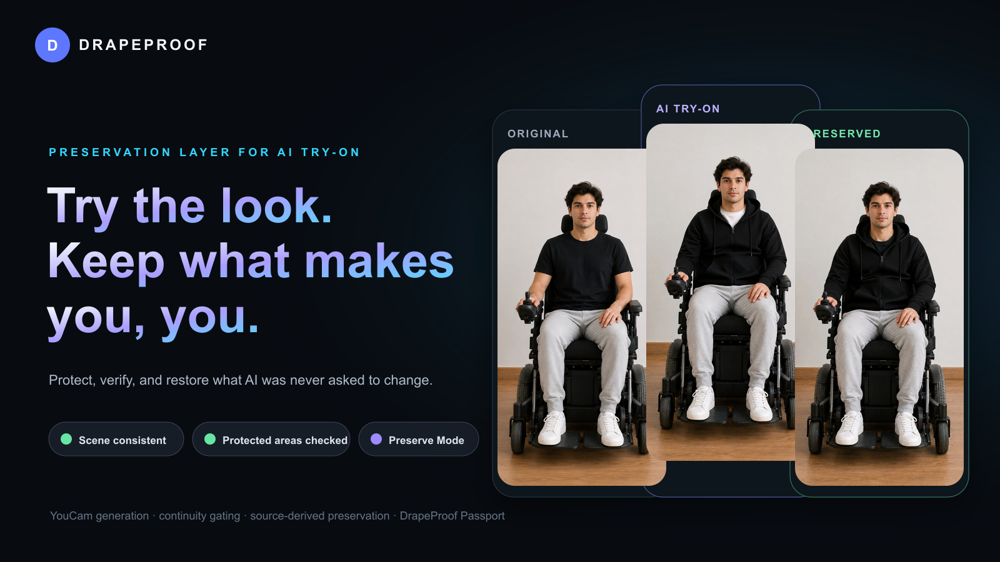
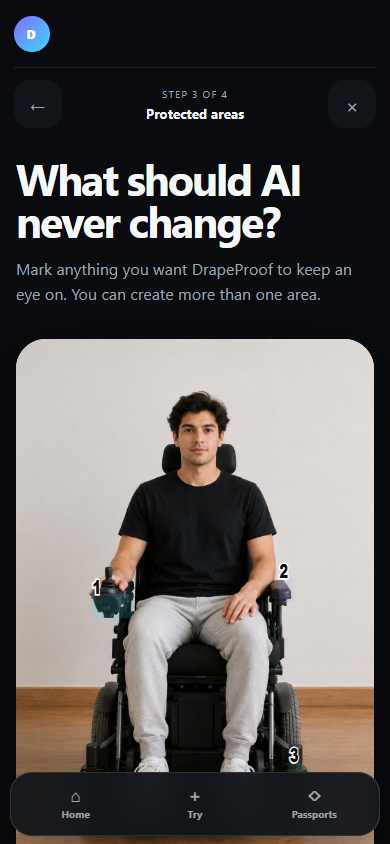
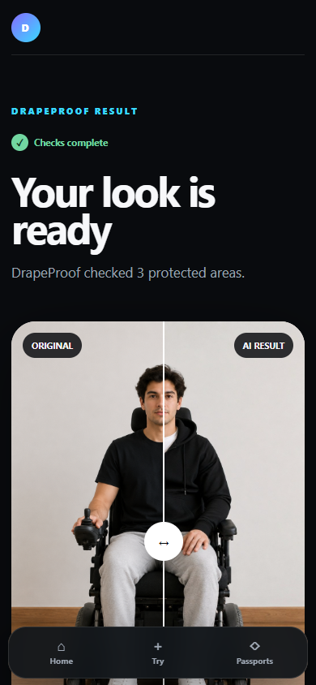
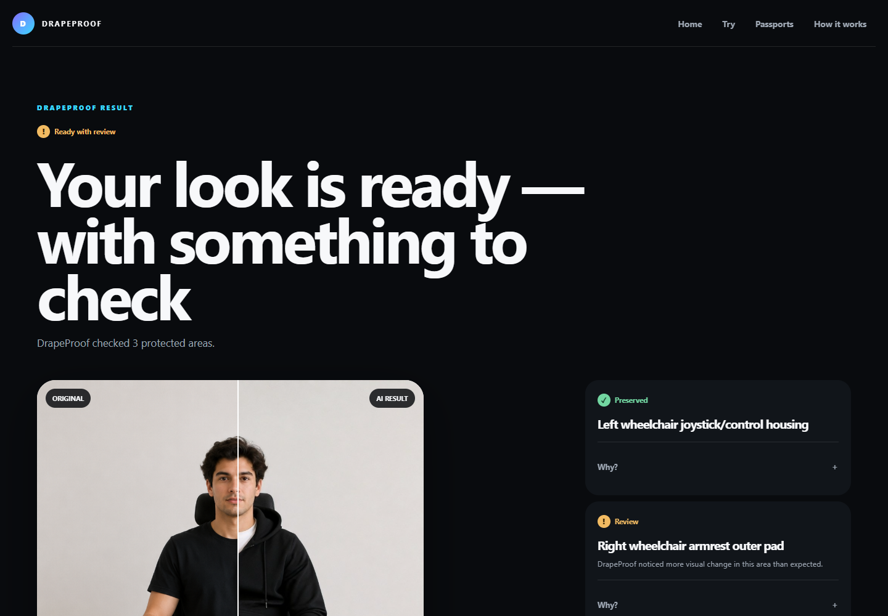
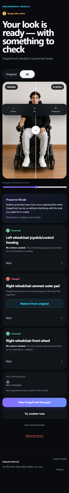
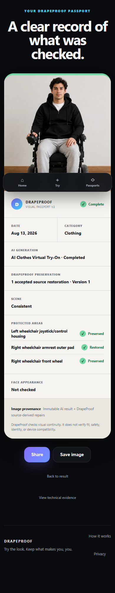
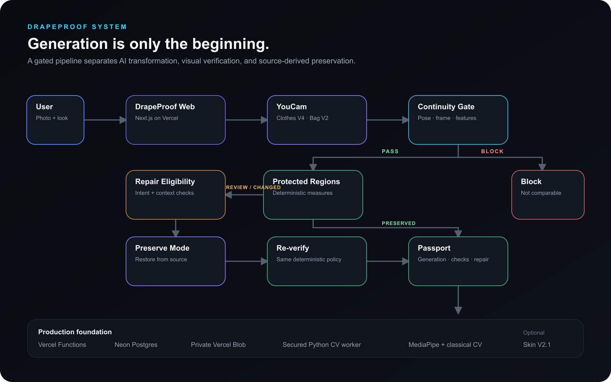
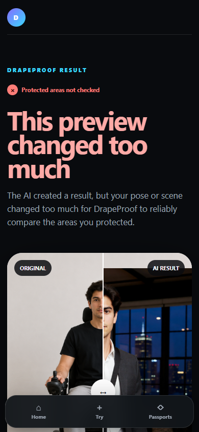

<p align="center">
  
</p>

# DrapeProof

**Try the look. Keep what makes you, you.**

DrapeProof is a preservation layer for generative fashion try-on. You choose what AI is allowed to change — and what should remain yours. YouCam generates the fashion transformation, while DrapeProof checks scene continuity, verifies protected regions, and can restore eligible areas from the original photo before re-verifying the result.

[**Try DrapeProof**](https://drapeproof-access.vercel.app) · [**How it works**](https://drapeproof-access.vercel.app/how-it-works)

Public beta. No account required.

## AI can change more than your outfit

A generative try-on can create the requested jacket, shirt, or accessory while also modifying something the person never asked it to touch: an assistive-device control, tattoo, piece of jewelry, scar, personal accessory, or any other user-selected visual detail.

> **Change the look. Preserve the person.**

DrapeProof makes that boundary explicit. It asks what matters, checks whether comparison is defensible, and refuses local verification or restoration when it is not.

## The product flow

| 01 | 02 | 03 | 04 | 05 | 06 |
|:--|:--|:--|:--|:--|:--|
| **Add your photo** | **Choose the look** | **Protect what matters** | **YouCam creates the try-on** | **DrapeProof verifies it** | **Restore eligible areas + Passport** |

The AI result always remains available as its own immutable version. A preserved result, when requested and accepted, is a separate source-derived image.

## Product showcase

<table>
  <tr>
    <td width="50%" align="center"><br /><sub><b>Protected Region Editor</b><br />Mark exactly what DrapeProof should inspect.</sub></td>
    <td width="50%" align="center"><br /><sub><b>Generated result</b><br />Compare the original and AI result in context.</sub></td>
  </tr>
</table>

<p align="center">
  
  <br /><sub>Protected-area results stay consumer-readable, with deeper measurements available separately.</sub>
</p>

<table>
  <tr>
    <td width="50%" align="center"><br /><sub><b>Preserve Mode</b><br />An explicit, source-derived restoration — never generative reconstruction.</sub></td>
    <td width="50%" align="center"><br /><sub><b>DrapeProof Passport</b><br />A clear record of generation, verification, and preservation.</sub></td>
  </tr>
</table>

The product-state screenshots above use recorded validation imagery rendered in the real interface. No new provider request was made to prepare this repository.

## What makes DrapeProof different

### Global Continuity Gate

Before comparing local regions, DrapeProof determines whether the generated scene is still geometrically comparable to the source. Pose landmarks, frame geometry, classical feature matching, and region mappability contribute independent signals. A failed gate blocks downstream claims.

### Protected Region Verification

Users explicitly choose what DrapeProof should inspect. The verifier applies deterministic measurements — including normalized pixel difference, changed-pixel ratio, SSIM, and edge difference — under a versioned policy.

### Preserve Mode

Eligible regions can be restored from the original photo using deterministic source-derived compositing. DrapeProof evaluates intended transformation overlap and surrounding context first, preserves the provider result, then re-runs verification on the separate derivative.

### DrapeProof Passport

The Passport separates three distinct things: what the AI provider generated, what DrapeProof checked, and what DrapeProof restored. It does not imply certification, identity verification, physical safety, or product suitability.

## Built with YouCam API

YouCam supplies the fashion transformation and optional visual-analysis capabilities around which DrapeProof builds its preservation pipeline.

- **Clothes Virtual Try-On V4** — the primary clothing-generation workflow.
- **Bag Virtual Try-On V2** — a supported accessory transformation and an important case for continuity gating.
- **Skin Analysis V2.1** — an optional visual-analysis signal for inspecting face-appearance consistency.

Skin Analysis is not used for medical diagnosis or biometric identity verification. DrapeProof is more than an API pass-through: it persists resumable provider state, gates comparability, verifies user-selected areas, offers bounded restoration, and records provenance without exposing provider credentials or private media.

## Architecture

<p align="center">
  
</p>

The production system uses Next.js route handlers and Vercel Functions, Neon Postgres, private Vercel Blob storage, and a secret-gated Python CV worker. The worker combines MediaPipe pose landmarks with classical feature matching; protected-region checks and Preserve Mode use deterministic TypeScript image processing.

## Under the hood

| Layer | Implementation |
|---|---|
| Frontend | Next.js, React, TypeScript |
| Backend | Vercel Functions, Next.js Route Handlers |
| Database | Neon Postgres |
| Private media | Vercel Blob |
| Fashion AI | Perfect Corp. YouCam APIs |
| Computer vision | Python worker, MediaPipe, OpenCV feature matching |
| Image verification | Sharp, SSIM, deterministic pixel and edge measurements |
| Infrastructure | Vercel |

## Designed to know when not to act

DrapeProof deliberately blocks local verification or restoration when:

- scene continuity fails;
- protected-region mapping is unreliable;
- a restoration footprint overlaps the intended transformation;
- the surrounding context is insufficient for a bounded restoration.

A continuity block is a legitimate safety boundary, not a failed attempt to manufacture confidence.

<p align="center">
  
</p>

## Security and privacy

- Anonymous-first ownership tokens; no account is required.
- Private media storage with owner-authorized retrieval.
- Server-only provider, database, storage, and cron credentials.
- A 24-hour session lifecycle with explicit deletion support.
- Privacy-minimized product events without image pixels or protected-area coordinates.
- Rate limits, provider budget controls, origin checks, and private cache headers.

Read the [privacy architecture](docs/PRIVACY_ARCHITECTURE.md) or the live [Privacy page](https://drapeproof-access.vercel.app/privacy).

## Try DrapeProof

The public beta is live at **[drapeproof-access.vercel.app](https://drapeproof-access.vercel.app)**. No account is required.

For a predictable evaluation flow, see [Testing DrapeProof](docs/TESTING.md). For the current engineering guarantees and boundaries, see [Technical validation](docs/TECHNICAL_VALIDATION.md).

## Run locally

### Requirements

- Node.js 20 or newer
- npm
- Python 3.12 with the pinned packages in `requirements.txt` for local continuity verification

### Install

```bash
npm install
npm --prefix web install
python -m pip install -r requirements.txt
```

Create a local `.env.local` from `.env.example`. The default local mode stores sessions under the ignored `.data/` directory and does not require Neon or Vercel Blob.

```bash
npm run dev
```

Open [http://localhost:3000](http://localhost:3000).

To use production persistence, set `DRAPEPROOF_PERSISTENCE=postgres-blob`, configure the production backend variables, and apply migrations:

```bash
npm run db:migrate
npm run db:verify
```

### Environment variables

Values belong only in local secret files or your deployment platform. Never expose them with a `NEXT_PUBLIC_` prefix.

| Name | Requirement | Purpose |
|---|---|---|
| `YOUCAM_API_KEY` | Production generation | Server-side YouCam credential |
| `DATABASE_URL` | Production | Pooled Neon connection |
| `DATABASE_URL_UNPOOLED` | Optional | Direct migration connection |
| `BLOB_READ_WRITE_TOKEN` | Production | Private Vercel Blob access |
| `DRAPEPROOF_OWNER_HASH_SECRET` | Production | Keyed anonymous ownership hashes |
| `CRON_SECRET` | Production | Cron and CV-worker authorization |
| `DRAPEPROOF_PUBLIC_URL` | Deployment | Canonical public origin |
| `DRAPEPROOF_VERIFICATION_WORKER_URL` | Optional | Explicit remote CV-worker URL |
| `DRAPEPROOF_PERSISTENCE` | Local optional | `local` or `postgres-blob` |
| `DRAPEPROOF_SESSION_TTL_HOURS` | Optional | Session retention window |
| `DRAPEPROOF_GENERATION_ENABLED` | Optional | Provider kill switch |
| `DRAPEPROOF_BETA_MODE` | Optional | Beta product state |
| `DRAPEPROOF_PROVIDER_DAILY_UNIT_BUDGET` | Optional | Daily provider-unit ceiling |
| `DRAPEPROOF_CLOTHES_V4_UNITS` | Optional | Clothes operation unit cost |
| `DRAPEPROOF_BAG_V2_UNITS` | Optional | Bag operation unit cost |
| `DRAPEPROOF_ANALYTICS_RETENTION_DAYS` | Optional | Product-event retention |
| `DRAPEPROOF_RATE_*` | Optional | Server-side rate-limit overrides |
| `DRAPEPROOF_WAF_*_ID` | Optional | Vercel WAF instrument IDs |

### Quality gates

```bash
npm test
npm run typecheck
npm run build
npm run audit:production
```

The default production smoke is provider-free:

```bash
npm run smoke:production -- https://drapeproof-access.vercel.app
```

It does not create a YouCam task. The live-provider runner is separately guarded and must never be used without explicit cost authorization.

## Repository map

```text
api/          secured Python verification worker
config/       versioned continuity and preservation policies
docs/         product assets and concise public documentation
migrations/   production database schema
models/       pinned MediaPipe model used by the worker
python/       Vercel Python runtime configuration
scripts/      migrations, health checks, cleanup, and guarded smoke tools
src/          provider clients, verification, preservation, and persistence
tests/        deterministic unit, integration, and contract tests
web/          Next.js product application
```

## Limitations

Visual verification does not establish physical fit, sizing, safety, device function, accessibility compatibility, medical condition, or biometric identity. AI generations may vary, image-based measurements can be inconclusive, and DrapeProof may block a comparison or restoration when its preconditions are not met.

The current release is a public beta and its verification policies are explicitly experimental rather than statistically validated.

## License

DrapeProof is licensed under the Apache License 2.0. See [LICENSE](./LICENSE).

Third-party dependencies and assets remain subject to their respective licenses and terms; the DrapeProof license does not relicense them.
